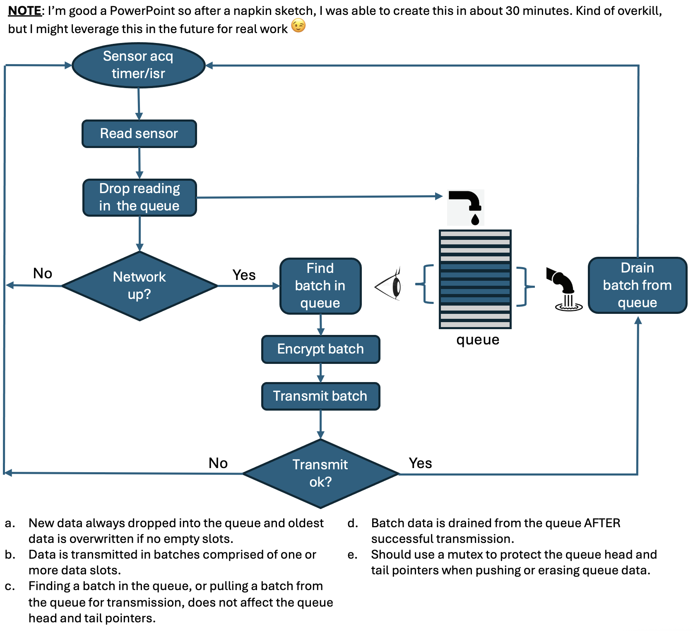

# R-Zero Sensor Handler

**Embedded Software Technical Lead Take-Home Assignment**

Andy Creque — April 2026

NOTE: This code will not compile or run. 
## Scenario
- R-Zero deploys sensors and gateways in commercial buildings to collect occupancy and environmental data.
- A small battery-powered microcontroller device reads occupancy sensor data on uneven intervals (roughly 10 time per minute = every 6 seconds) and sends these readings to the cloud immediately.

## Challenge
Start with the code block below and modify to extend the routine to handle intermittent network connectivity without losing data. Policy dictates that all data must be encrypted. Add encryption to the data transmission.

```
void read_and_send_occupant_count()
{
    int occupant_count = read_sensor(); 
    send_to_cloud(occupant_count); 
}
```

## Key Design Decisions




### 1. Decouple acquisition from transmission

`read_and_send_occupant_count()` always drops readings in a queue  as they become avaiable. Then attempts to transmit across network and drain queue. If the network is unavailable, the function returns immediately without draining the queue and untransmitted readings are safely retained. No readings are lost on transient network outages.

### 2. Circular queue, static allocation

Fixed-size queue. No `malloc`/`free`. Predictable memory footprint,
no fragmentation. 

### 3. Queue eviction policy

When the queue is full and a new reading arrives, the oldest entry is discarded. Assumes recent occupancy data is more actionable than stale readings.

### 4. Evict after confirm

`queue_find_batch()` copies readings without advancing the queue tail pointer. `queue_drain()` advances the tail **ONLY AFTER** `hal_network_send()` returns success. If send fails, the same data is retried on the next cycle.

### 5. AES-CCM encryption algorithm

The solution assumes the AES-CCM encryption algorithm will be used. The GCM version of this is the gold standard but requires hardware acceleration to be useful, which is not always available on constrained devices. CCM still benefits from hardware acceleration, but is useful on devices without it. They are both virtually uncrackable and provides both confidentiality and authenticity in a single operation. Both rely a shared secret or key.

### 6. Key management

The shared secret/key must be managed carefully and this is not part of the scope of this solution. Key should be loaded from an encrypted non-volatile storage partition or from an external secure element like the ATECC608. Key rotation should be handled via authenticated OTA or secure provisioning protocol.

### 7. Code Structure

The code for the solution consists of less than 300 lines of code including comments and is contained in one file: ```main.c```

The soluiton relies on a timer call-back and mutex provided by an RTOS. FreeRTOS was assumed in the code provided.

From top to bottom main.c contains:
- Data structure definintions.
- System state variable declarations.
- Network stub functions.
- Queue management functions.
- Encryption stub function.
- System initialization function.
- ```read_and_send_occupant_count()``` function where all the work is done.
- Timer call-backfunction, which calls ```read_and_send_occupant_count()``` 
- Main program entry point function ```app_main()```


---

## Additions to Consider

| Item | Notes |
|------|-------|
| Non-volatile storage queue persistence | Survive power cycles, but requires wear-leveling |
| SNTP time sync | Replace boot-relative timestamp with real Unix epoch |
| Exponential backoff | Avoid hammering server on repeated failures |
| Watchdog integration | Ensure send() can't block indefinitely |
| Secure key provisioning | ATECC608 or NVS encrypted partition |
| Unit tests | esp-idf-unity framework for queue boundary conditions |
| Cloud deduplication | Receiver uses sequence_num to drop duplicate batches on retry |

---

## Circular Queue Demo (`circular_queue.py`)

A small interactive Python script that visualizes the same fixed-size circular queue behavior described in Design Decision #2. It is a teaching/illustration aid — useful for sanity-checking the head/tail pointer logic and the "overwrite oldest on full" eviction policy used in `main.c`.

### What it does
- Implements a `CircularQueue` class with `enqueue`, `dequeue`, `peek`, `is_full`, and `is_empty`.
- Uses static-style backing storage (a fixed-length list) with `head`, `tail`, and `count` indices — no dynamic growth.
- On overflow, `enqueue` overwrites the oldest element and returns the evicted value, mirroring the firmware's eviction policy.
- After every operation, prints an ASCII diagram showing slot positions, current contents, and the `H`/`T` pointers.

### How to use
Run the script with Python 3 (no dependencies required):

```
python3 circular_queue.py
```

At the `Command:` prompt:

| Input | Action |
|-------|--------|
| an integer (e.g. `27`) | Enqueue that value |
| one or more `-` (e.g. `---`) | Dequeue that many elements |
| `p` | Peek — list live items in FIFO order without modifying the queue |
| `q` (or `quit` / `exit`) | Exit the demo |

### Example session
```
Circular Queue Demo (size = 4)
Enter a number to enqueue it (e.g. 27).
Enter one or more '-' to dequeue (e.g. --- dequeues 3 elements).
Enter 'p' to peek (show live items in FIFO order).
Enter 'q' to quit.

Initial state:
  positions:   0      1      2      3   
  contents:  [ .  ] [ .  ] [ .  ] [ .  ]
  pointers:   H/T
  (count = 0)

Command: 1
  Enqueued 1.
  positions:   0      1      2      3   
  contents:  [ 1  ] [ .  ] [ .  ] [ .  ]
  pointers:    H      T
  (count = 1)

Command: 2
  Enqueued 2.
  positions:   0      1      2      3   
  contents:  [ 1  ] [ 2  ] [ .  ] [ .  ]
  pointers:    H             T
  (count = 2)

Command: 3
  Enqueued 3.
  positions:   0      1      2      3   
  contents:  [ 1  ] [ 2  ] [ 3  ] [ .  ]
  pointers:    H                    T
  (count = 3)

Command: 4
  Enqueued 4.
  positions:   0      1      2      3   
  contents:  [ 1  ] [ 2  ] [ 3  ] [ 4  ]
  pointers:   H/T
  (count = 4)

Command: 5
  Queue was full: overwrote 1 with 5.
  positions:   0      1      2      3   
  contents:  [ 5  ] [ 2  ] [ 3  ] [ 4  ]
  pointers:          H/T
  (count = 4)

Command: 6
  Queue was full: overwrote 2 with 6.
  positions:   0      1      2      3   
  contents:  [ 5  ] [ 6  ] [ 3  ] [ 4  ]
  pointers:                 H/T
  (count = 4)

Command: -
  Dequeued 3.
  positions:   0      1      2      3   
  contents:  [ 5  ] [ 6  ] [ .  ] [ 4  ]
  pointers:                  T      H
  (count = 3)

Command: -
  Dequeued 4.
  positions:   0      1      2      3   
  contents:  [ 5  ] [ 6  ] [ .  ] [ .  ]
  pointers:    H             T
  (count = 2)

Command: -
  Dequeued 5.
  positions:   0      1      2      3   
  contents:  [ .  ] [ 6  ] [ .  ] [ .  ]
  pointers:           H      T
  (count = 1)

Command: -
  Dequeued 6.
  positions:   0      1      2      3   
  contents:  [ .  ] [ .  ] [ .  ] [ .  ]
  pointers:                 H/T
  (count = 0)

Command: -
  Queue is empty! Cannot dequeue.
  positions:   0      1      2      3   
  contents:  [ .  ] [ .  ] [ .  ] [ .  ]
  pointers:                 H/T
  (count = 0)
```
